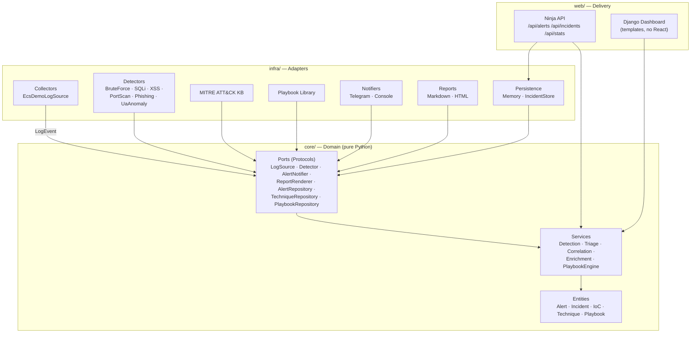
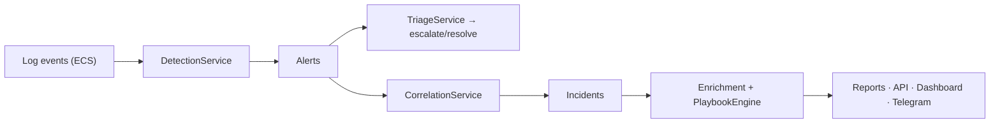

# SOC Triage Lab

A working **Security Operations Center laboratory** that demonstrates the full
L1-analyst workflow: **collect → detect → correlate → respond → visualize**.

Built with **Django + Ninja** using a **hexagonal (Ports & Adapters) architecture** —
a clean domain core with swappable adapters, exactly the way production SOC
tooling is structured.

> *"We believe in potential, not perfection."* — this project is built to show
> **how a SOC analyst thinks**: how an alert becomes an incident, how severity is
> decided, how MITRE ATT&CK guides the response, and how everything is documented.

---

## Highlights

- **Hexagonal architecture** — domain (`core/`) has zero Django imports and is
  tested with plain pytest; infrastructure (`infra/`) plugs in via ports
  (Protocols). Swap the log source, notifier or renderer without touching the core.
- **6 detection adapters**, all mapped to MITRE ATT&CK with practical L1 guidance
  (brute-force, SQLi, XSS, port-scan, phishing, scanner UAs).
- **Triage engine** with a configurable L1 escalation policy.
- **Correlation** into incidents — by IoC, source IP, or technique.
- **Playbooks** bound to incidents by technique, with ordered L1/L2 steps.
- **Reports** — Markdown and HTML renderers (XSS-escaped).
- **Telegram escalation** (degrades gracefully to console when no token is set).
- **Deterministic ECS-formatted demo logs** (Elastic Common Schema field names) —
  the same shape a real SIEM pipeline would feed in.
- **Ninja API** + server-rendered dashboard (no React — deliberately minimal).
- **88+ tests** including an end-to-end pipeline test.

## Quickstart

### Docker (easiest)

```bash
docker compose up --build
```

Runs the demo pipeline and writes incident reports to `./reports/`.

### Local with uv

```bash
uv sync                       # install dependencies (uv only, no pip)
uv run python manage.py scan_logs            # run the pipeline -> reports/
uv run python manage.py runserver            # start the dashboard + API
```

Then open:

- Dashboard: <http://localhost:8000/>
- API docs:  <http://localhost:8000/api/docs>
- Health:    <http://localhost:8000/api/health>

## What it does

A single command runs the whole flow:

```text
[collect]   55 events from ecs-demo
[detect]    13 alerts fired
[triage]    13 escalated, 0 resolved
[correlate] 5 incidents (strategy=ioc)
[report]    reports/INC-....md
```

Example output (an incident report): see [`docs/example-incident.md`](docs/example-incident.md).

## Architecture — hexagonal



**The rule:** the domain knows nothing about Django, HTTP, Telegram or files.
Every adapter implements a port and is injected into a service. That is what
makes the core testable in milliseconds without a framework.

### Data flow



## API

| Method | Path | Description |
|--------|------|-------------|
| GET | `/api/health` | Liveness |
| POST | `/api/scan` | Run the demo pipeline |
| GET | `/api/alerts` | Alerts from the last run |
| GET | `/api/incidents` | Incidents (optional `?severity=HIGH`) |
| GET | `/api/incidents/{id}` | Incident detail (alerts, playbook steps) |
| GET | `/api/stats` | Aggregated statistics |

## Demo scenarios (all ECS-formatted)

| Scenario | Detector | MITRE | Result |
|----------|----------|-------|--------|
| Password guessing | `BruteForceDetector` | T1110.001 | HIGH alert |
| SQL injection | `SqlIDetector` | T1190 | HIGH alert |
| XSS attempt | `XssDetector` | T1059.007 | HIGH alert |
| Port scanning | `PortScanDetector` | T1046 | MEDIUM alert |
| Phishing email | `PhishingAnalyzer` | T1566 | HIGH alert |
| Scanner UA | `UaAnomalyDetector` | T1595 | MEDIUM alert |

The generator is **deterministic** (seeded) — the same seed reproduces the same
event stream, which makes the demo reliable for interviews and CI.

## Project layout

```text
soc-triage-lab/
├── config/          # Django settings, urls
├── core/            # DOMAIN — entities, ports, services (no Django!)
│   ├── entities/    #   Alert, Incident, IoC, Technique, Playbook, Severity
│   ├── ports/       #   Protocols (interfaces)
│   └── services/    #   Use-cases (Detection, Triage, Correlation, ...)
├── infra/           # ADAPTERS — collectors, detectors, notifiers, reports, ...
├── web/             # DELIVERY — Ninja API + dashboard templates
├── workers/         # pipeline.py + management commands
├── tests/           # 90+ tests (domain runs without Django)
└── docs/            # triage scenario, example report
```

## Tests

```bash
uv run pytest
```

The domain tests do **not** require Django — they run in milliseconds and prove
the core is framework-agnostic.

## Why no React?

This project is a SOC portfolio, not a frontend showcase. The dashboard is
deliberately minimal (server-rendered templates). The value is in the detection
and triage logic — that is what an L1 analyst does every day. Adding a heavy SPA
would add noise, not signal.

## License

[MIT](LICENSE) © 2026 Vladimir Bigunenko
